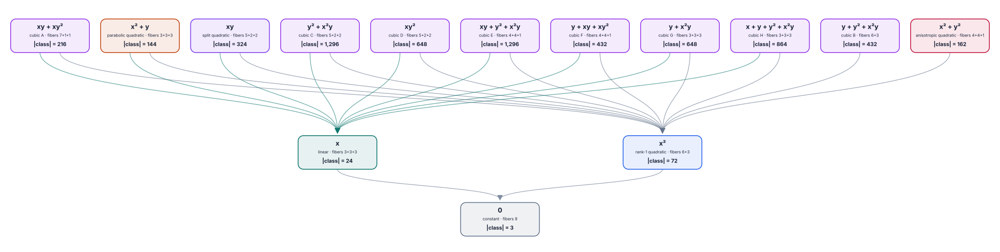
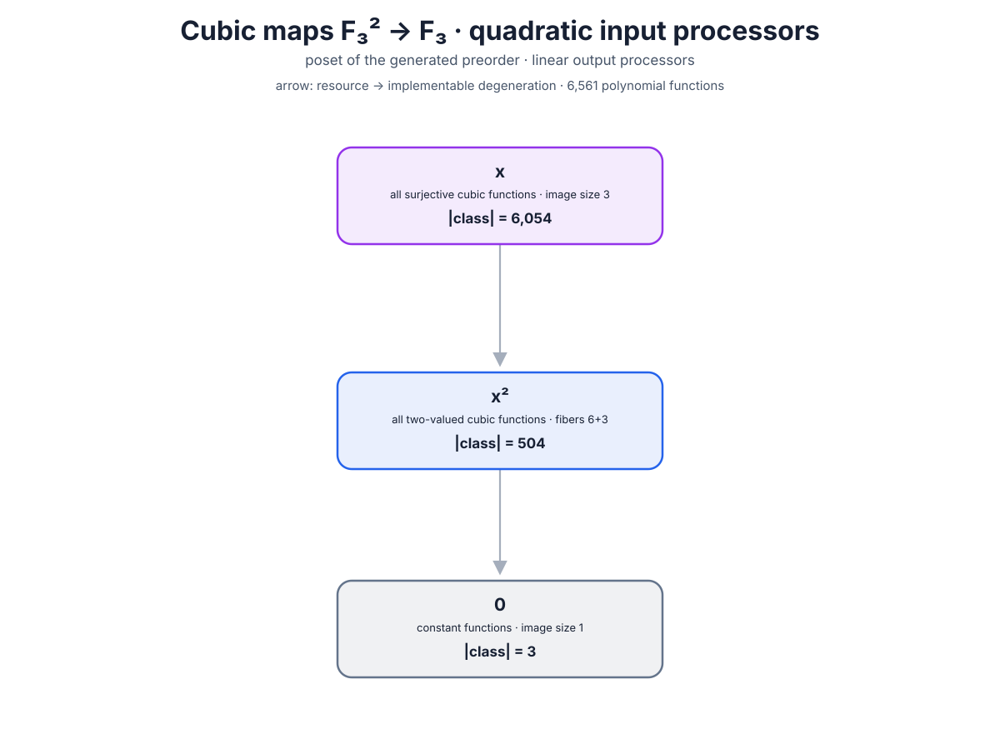

# Cubic-map degeneration posets over \(\mathbb F_3\)

This note classifies degree-at-most-three polynomial functions

\[
f\colon\mathbb F_3^2\longrightarrow\mathbb F_3
\]

for two choices of input processors. Output processors are affine-linear in
both cases and may be singular, including constants.

Because \(x^3=x\) and \(y^3=y\) as functions on \(\mathbb F_3\), every such
function has a unique expression in the eight-dimensional basis

\[
1,x,y,x^2,xy,y^2,x^2y,xy^2.
\]

There are therefore

\[
3^8=6{,}561
\]

distinct cubic polynomial functions. Class sizes in both diagrams count
functions, not ten-coefficient formal polynomial expressions.

## Case 1: affine-linear input and output processors

Equivalence uses invertible affine input and output transformations. The
degeneration order allows singular affine input maps and constant input or
output processors. Exhaustive enumeration of the \(6{,}561\) functions under
the \(432\) invertible affine input maps and six invertible affine output maps
gives 14 equivalence classes.

| representative | fiber sizes | class size |
|---|---:|---:|
| \(0\) | \(9\) | 3 |
| \(x\) | \(3+3+3\) | 24 |
| \(x^2\) | \(6+3\) | 72 |
| \(x^2+y\) | \(3+3+3\) | 144 |
| \(x^2+y^2\) | \(4+4+1\) | 162 |
| \(xy+xy^2\) | \(7+1+1\) | 216 |
| \(xy\) | \(5+2+2\) | 324 |
| \(y+y^2+x^2y\) | \(6+3\) | 432 |
| \(y+xy+xy^2\) | \(4+4+1\) | 432 |
| \(xy^2\) | \(5+2+2\) | 648 |
| \(y+x^2y\) | \(3+3+3\) | 648 |
| \(x+y+y^2+x^2y\) | \(3+3+3\) | 864 |
| \(y^2+x^2y\) | \(5+2+2\) | 1,296 |
| \(xy+y^2+x^2y\) | \(4+4+1\) | 1,296 |

The sizes sum to \(6{,}561\). The eleven classes other than constant,
linear, and rank-one quadratic are maximal. Every maximal class degenerates
to \(x^2\); all except \(y+y^2+x^2y\) and \(x^2+y^2\) also degenerate to
\(x\). Finally both \(x\) and \(x^2\) degenerate to a constant.



## Case 2: quadratic input and affine-linear output processors

A one-step relation using coordinatewise degree-at-most-two input maps is not
transitive: composing two quadratic input maps can have degree four. To obtain
a genuine partial order, the diagram uses the preorder generated by finite
chains of such reductions, then quotients by mutual reachability.

Exhaustive enumeration of all

\[
729^2=531{,}441
\]

quadratic input maps \(\mathbb F_3^2\to\mathbb F_3^2\) gives only three
mutual-reachability classes:

| class | representative | number of functions |
|---|---:|---:|
| surjective cubic functions | \(x\) | 6,054 |
| two-valued functions, fibers \(6+3\) | \(x^2\) | 504 |
| constants | \(0\) | 3 |

They form the chain

\[
[\text{surjective}]
\longrightarrow
[\text{two-valued, }6+3]
\longrightarrow
[\text{constant}].
\]

The large collapse is a property of the generated preorder. It must not be
read as classification under a group of invertible quadratic substitutions:
bounded-degree polynomial substitutions are not closed under composition.



## Regeneration

Generate both SVGs from the project root with

```bash
./cli/cubic_map_poset_cli
```

Generate just one processor case or use another output directory with

```bash
./cli/cubic_map_poset_cli --case quadratic --output-dir /tmp/cubic-posets
```

The exhaustive verifier used to check the orbit sizes, reachability relation,
strongly connected components, and Hasse covers is

```bash
python analysis/cubic_q3_posets.py
```
