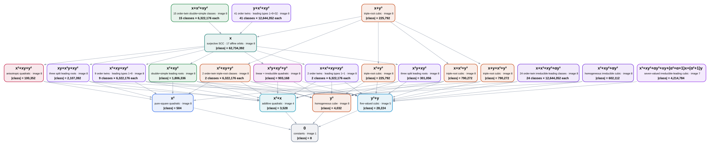

# Cubic-map degeneration poset over \(\mathbb F_8\)

This note classifies degree-at-most-three polynomial maps

\[
f\colon\mathbb F_8^2\longrightarrow\mathbb F_8
\]

when input processors have coordinate degree at most two and output processors
are affine-linear.  The field is represented as

\[
\mathbb F_8=\mathbb F_2[\alpha]/(\alpha^3+\alpha+1).
\]

Unlike over \(\mathbb F_3\), the ten monomials of total degree at most three
give distinct functions over \(\mathbb F_8\).  The classified universe therefore
contains

\[
8^{10}=1{,}073{,}741{,}824
\]

polynomial functions.

## Relation and quotient

For a degree-at-most-three map \(f\), one allowed step has the form

\[
g(x,y)=a\,f(P(x,y),Q(x,y))+b,
\qquad \deg P,\deg Q\leq 2,
\]

provided \(g\) again has degree at most three.  The output scale \(a\) may be
zero, so constants are allowed.  As in the \(q=3\) diagram, the plotted order is
the transitive closure of these steps, quotiented by mutual reachability.

The calculation first finds 126 orbits under invertible affine input and output
maps.  The generated preorder has 110 mutual-reachability classes.  One of
them is a strongly connected component containing 17 affine orbits; every
other generated class consists of one affine orbit.

The exact 110-node Hasse diagram has many order-theoretic twins.  Six
antichains consist of nodes having the same strict upper set, the same strict
lower set, and the same size.  The image groups each such antichain in one
multiplicity box, leaving 23 boxes.  A label such as
“24 classes × 12,644,352 each” denotes 24 distinct, pairwise-incomparable
poset elements, not one class of their combined size.



Arrows point from a resource map to an implementable degeneration.  The sizes
printed in singleton boxes count polynomial functions in that generated class.
The weighted sum of all boxes is \(8^{10}\).

## Why this is not the \(q=3\) chain

The three-node \(q=3\) diagram uses the functional identities \(x^3=x\) and
\(y^3=y\).  They do not hold over \(\mathbb F_8\).  Over \(\mathbb F_8\), the
leading homogeneous cubic retains its factorization type and creates strong
restrictions on quadratic substitutions.

For example, let \(H\) be an irreducible binary cubic and let \(P_2,Q_2\) be
the homogeneous quadratic parts of an input processor.  Cancellation of the
degree-six part requires

\[
H(P_2,Q_2)=0.
\]

Irreducibility forces \(P_2=Q_2=0\), so such a source permits only affine input
processors.  This accounts for 26 maximal irreducible-leading classes: one
homogeneous class, 24 order-twin surjective classes, and one seven-valued
class.  Across all 126 affine orbits, the only image cardinalities are
\(1,4,5,7,8\).

## Regeneration and verification

Regenerate the SVG from the project root with Graphviz installed:

```bash
./cli/cubic_map_poset_cli --q 8 --case quadratic
```

The independent exhaustive classifier and reduction enumerator is the C++
program

```bash
g++ -O3 -std=c++17 analysis/cubic_q8_poset.cpp -o /tmp/cubic_q8_poset
/tmp/cubic_q8_poset exact
```

It uses \(\mathbb F_8=\mathbb F_2[\alpha]/(\alpha^3+\alpha+1)\), enumerates
affine stabilizer orbits, normalizes every admissible quadratic branch, builds
the transitive closure, and checks class sizes against the full
\(8^{10}\)-element universe.
