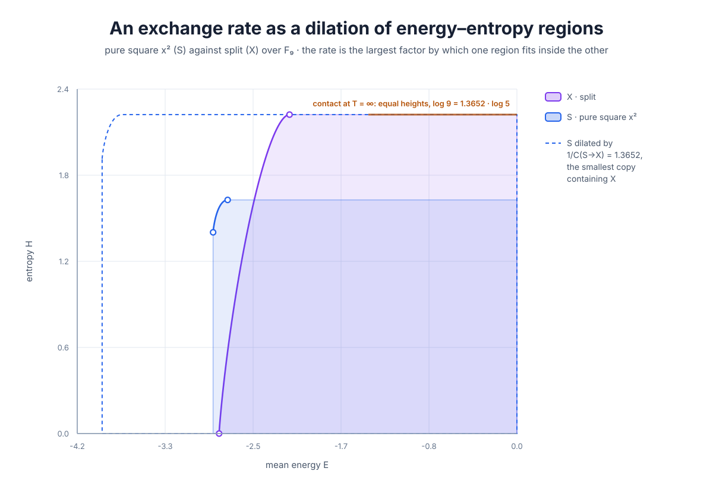
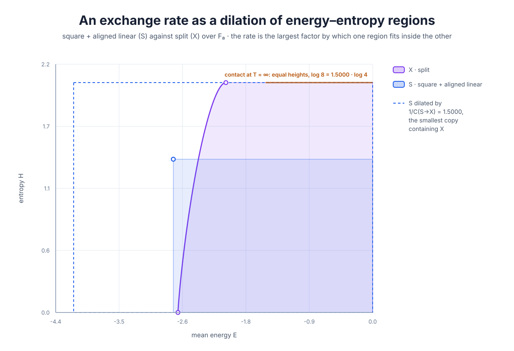
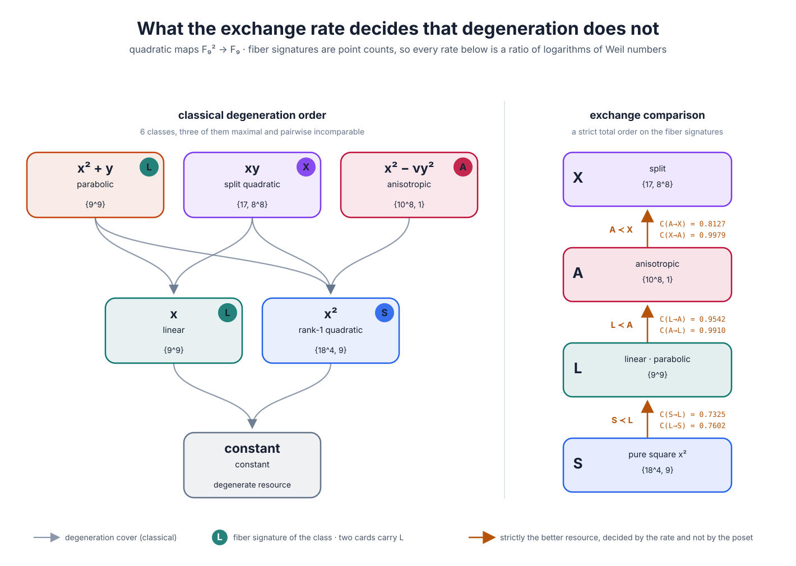
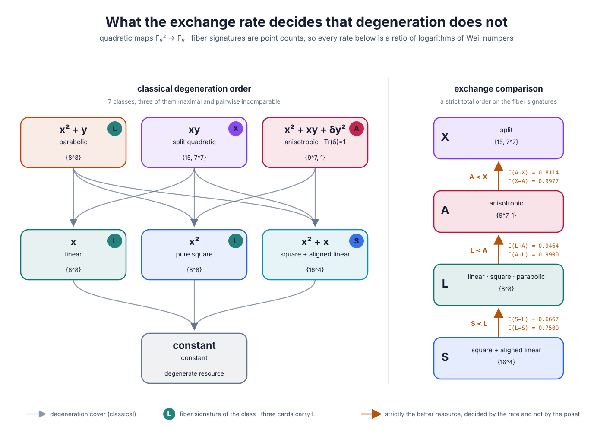
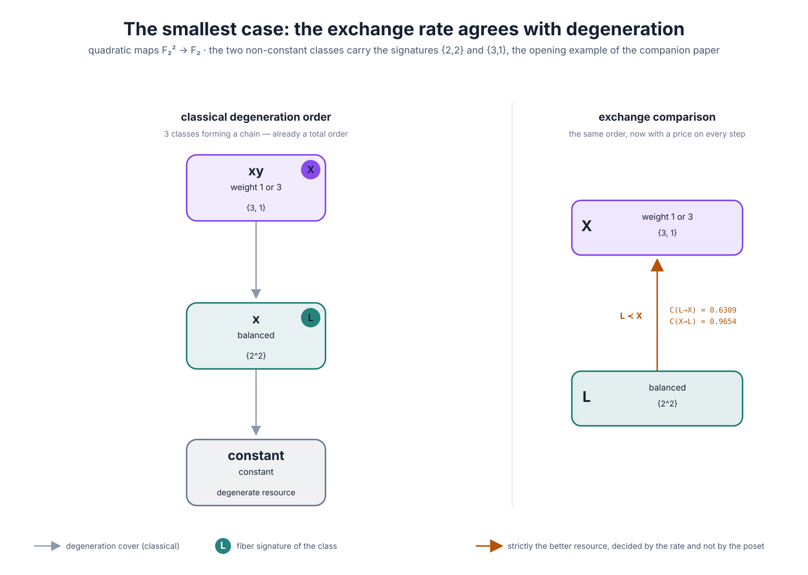

# The exchange matrix of quadratic maps over \(\mathbb F_q\)

The degeneration posets say which classes can be obtained from which. They do
not say at what price. This section computes the price: the full matrix of
asymptotic exchange rates between the classes of degree-at-most-two maps
\(\mathbb F_q^2\to\mathbb F_q\), for every prime power \(q\).

Two things come out of it. Eight of the sixteen entries are exact ratios of
logarithms of point counts, so **the exchange rate between two classes is a
Weil number**. And the rates strictly order three classes that the degeneration
poset leaves incomparable, so **the exchange rate is not a re-encoding of the
poset: it decides comparisons the classical order declines to make**.

Everything below is generated by `analysis/finite_field_exchange_matrix.py`.

## Signatures are point counts

The fiber signature of a map \(\mathbb F_q^2\to\mathbb F_q\) is the multiset of
its fiber cardinalities, and for a quadratic map each fiber is an affine
conic. Its cardinality is \(q\) corrected by the trace of Frobenius, so the
signature is nothing but the list of Weil numbers of the fibers.

| class | representative | signature | fibers | largest |
|---|---|---|---:|---:|
| \(K\) | constant | \(\{q^2\}\) | \(1\) | \(q^2\) |
| \(L\) | \(x\) and \(x^2+y\) | \(\{q,\ldots,q\}\) | \(q\) | \(q\) |
| \(S\) | \(x^2\) (odd \(q\)) | \(\{2q,\ldots,2q,q\}\) | \(\tfrac{q+1}2\) | \(2q\) |
| \(S\) | \(x^2+x\) (even \(q\)) | \(\{2q,\ldots,2q\}\) | \(\tfrac q2\) | \(2q\) |
| \(X\) | \(xy\) | \(\{2q-1,q-1,\ldots,q-1\}\) | \(q\) | \(2q-1\) |
| \(A\) | \(x^2-\nu y^2\) | \(\{q+1,\ldots,q+1,1\}\) | \(q\) | \(q+1\) |

Each row sums to \(q^2\). The \(2q-1\) is the singular fiber of the split
conic, a pair of lines; the \(q+1\) is the anisotropic norm form, whose fibers
are the nonzero norms of \(\mathbb F_{q^2}\); the isolated \(1\) is the origin,
the only zero of an anisotropic form.

Two remarks before the matrix, both of which the paper should make in the open.

**The signature is coarser than the poset.** The linear map \(x\) and the
parabolic map \(x^2+y\) have the same signature \(\{q,\ldots,q\}\), although the
poset separates them --- \(x^2+y\) is maximal and \(x\) is not. In even
characteristic \(x^2\) joins them, since Frobenius is a bijection. So the
exchange theory sees three poset classes as one resource. It records how many
points sit over each output, not how they sit.

**The constant class is degenerate.** \(K\) has one fiber, so
\(\log Z_K(0)=0\): it is the zero of the semiring, with
\(C(K\to f)=0\) and \(C(f\to K)=\infty\) for every non-constant \(f\). It is
omitted from the matrix.

## The matrix

Rows are implementers, columns are targets; the entry is \(C(g\to f)\), the
number of copies of \(f\) obtainable per copy of \(g\). Sample values at
\(q=101\):

|  | \(S\) | \(L\) | \(A\) | \(X\) |
|---|---:|---:|---:|---:|
| \(S\to\) | \(1\) | \(0.85194430\) | \(0.85194430\) | \(0.85194430\) |
| \(L\to\) | \(0.86942121\) | \(1\) | \(0.99786976\) | \(0.87023481\) |
| \(A\to\) | \(0.87127724\) | \(0.99924491\) | \(1\) | \(0.87209257\) |
| \(X\to\) | \(0.91550883\) | \(0.99987598\) | \(0.99985986\) | \(1\) |

Eight of the twelve off-diagonal entries are attained at an endpoint of the
temperature range and have exact closed forms, valid for every prime power
\(q\). Write \(r_S\) for the number of fibers of \(S\), that is
\((q+1)/2\) for odd \(q\) and \(q/2\) for even \(q\).



The rate is a containment of planar regions. Over \(\mathbb F_9\), dilating the
pure-square region by \(1/C(S\to X)=\log9/\log5=1.3652\) gives the smallest copy
containing the split region, and the two boundaries touch along their top edge:
the bottleneck is at \(T=\infty\), where the comparison is a count of fibers.

Even characteristic gives the same picture with a round factor, since both
signatures are then flat and both regions are rectangles:
\(1/C(S\to X)=\log q/\log(q/2)\), which is \(2\) at \(q=4\), \(3/2\) at \(q=8\)
and \(4/3\) at \(q=16\). Over \(\mathbb F_2\) the contact moves to the other
endpoint: the pair drawn is \(\{2,2\}\) against \(\{3,1\}\), which have the same
number of fibers, so the bottleneck is at \(T=0\) and the two regions touch along
their left edge, with \(\log3=1.5850\cdot\log2\).



**Dimension-limited row (\(\beta=0\), \(T=\infty\)).** The implementer \(S\) has
too few fibers, and that alone decides every rate out of it:

\[
C(S\to L)=C(S\to A)=C(S\to X)=\frac{\log r_S}{\log q}.
\]

For even \(q\) this is \(1-\log2/\log q\) exactly. The three targets all have
\(q\) fibers, which is why one number serves for all three: the bottleneck is a
count of outputs and nothing else.

**Bandwidth-limited entries (\(\beta=\infty\), \(T=0\)).** Here the largest
fiber decides:

\[
C(L\to S)=\frac{\log q}{\log 2q},\quad
C(L\to X)=\frac{\log q}{\log(2q-1)},\quad
C(L\to A)=\frac{\log q}{\log(q+1)},
\]
\[
C(A\to S)=\frac{\log(q+1)}{\log 2q},\qquad
C(A\to X)=\frac{\log(q+1)}{\log(2q-1)}.
\]

Every one of these is a ratio of logarithms of point counts of conics. The
generator confirms all eight closed forms to machine precision at every
tabulated \(q\).

**Interior contacts.** The remaining four rates are attained at a finite
bottleneck temperature and have no closed form, but they do have clean
expansions. Two of them approach \(1\) at the Weil scale:

\[
C(X\to L)=1-\frac{\lambda}{q\log q}+O(q^{-2}),
\qquad
\lambda=\max_{\beta>0}\frac{\beta+1-2^\beta}{\beta+1}=0.057915307318\ldots,
\]
attained at \(\beta_*=0.442695\ldots\), and

\[
C(X\to A)=1-\frac{\kappa}{q\log q}+O(q^{-2}),
\qquad
\kappa=\max_{\beta>0}\frac{2\beta-2^\beta}{\beta+1}=0.068755890904\ldots,
\]
attained at \(\beta_*=1.478297\ldots\). Both expansions match the computed rates
to three digits already at \(q=101\), and the numerically observed bottleneck
temperatures converge to the predicted \(\beta_*\).

The other two behave differently. \(C(A\to L)\) is
\(1-\mu_q/(q\log q)\) with
\(\mu_q=\max_\beta(1-\beta-q^{-\beta})/(\beta+1)\), which drifts towards \(1\)
like \(1-O(\log\log q/\log q)\): the bottleneck temperature migrates to
\(\beta\sim1/\log q\), so the expansion carries a second logarithm.
And \(C(X\to S)\) has both endpoints tending to \(1\) while the minimum stays
near \(0.9\), with bottleneck \(\beta_*\sim\log_2q\) --- the temperature at which
the single singular fiber \(2q-1\) overtakes the \(q-1\) ordinary fibers. It is
the one entry where the exceptional fiber, rather than the generic count, sets
the price:

| \(q\) | 5 | 31 | 101 | 509 | 2003 |
|---|---:|---:|---:|---:|---:|
| \(C(X\to S)\) | \(0.89826\) | \(0.90680\) | \(0.91551\) | \(0.92669\) | \(0.93475\) |
| \(\beta_*\) | \(3.48\) | \(4.67\) | \(5.80\) | \(7.54\) | \(9.14\) |
| \(\log_2q\) | \(2.32\) | \(4.95\) | \(6.66\) | \(8.99\) | \(10.97\) |

Both figures exist for every order in the poset gallery ---
\(q=2,4,8,9,16,25\) --- and the pattern is uniform. Two samples at the larger
orders, one of each parity:

| \(q\) | classes | cards carrying \(L\) | \(C(S\to L)\) | \(C(L\to S)\) | \(C(A\to X)\) | dilation drawn |
|---:|---:|---:|---:|---:|---:|---|
| \(16\) | 7 | 3 | \(\log8/\log16=0.75\) | \(\log16/\log32=0.80\) | \(\log17/\log31=0.8251\) | \(4/3\) |
| \(25\) | 6 | 2 | \(\log13/\log25=0.7968\) | \(\log25/\log50=0.8228\) | \(\log26/\log49=0.8372\) | \(\log25/\log13=1.2549\) |


## What the rates decide that the poset does not

Recall the odd-\(q\) Hasse covers:

\[
[x^2+y]\to[x],[x^2];\qquad
[xy]\to[x],[x^2];\qquad
[x^2-\nu y^2]\to[x^2];\qquad
[x],[x^2]\to[\text{const}].
\]

The poset has three maximal elements --- parabolic, split, anisotropic --- and
they are pairwise incomparable; \(x\) and \(x^2\) are incomparable as well. The
classical theory stops there, and correctly so: no chain of degenerations
relates a split conic to an anisotropic one.

The exchange comparison \(a\prec b\iff C(a\to b)<C(b\to a)\) does not stop
there.



The left panel is the classical poset; the badges record which fiber signature
each class carries, and two of them carry \(L\), which is the merge above. The
right panel is what the rate adds.

In even characteristic the merge is wider, because Frobenius is a bijection and
\(x^2\) joins the flat class: *three* of the seven classes carry \(L\), and the
role of the small non-flat class passes to the Artin--Schreier map \(x^2+x\),
whose signature \(\{(2q)^{q/2}\}\) is itself flat. The ladder is unchanged.



The binary field is the one case where the exchange rate decides nothing new,
and it is worth showing for a different reason. Over \(\mathbb F_2\) the
identities \(x^2=x\) and \(y^2=y\) hold as functions, so only three classes
survive and the poset is already the chain
\([xy]\to[x]\to[\mathrm{constant}]\). The two non-constant classes have
signatures

\[
\sigma(x)=\{2,2\},\qquad \sigma(xy)=\{3,1\},
\]

which are exactly the pair the companion paper opens with, and the rates are
its two opening numbers, \(\log2/\log3=0.6309\) and \(0.9654\). So the smallest
finite field is where the two papers meet: the introductory example of the first
is the classification of quadratic maps over \(\mathbb F_2\).



**Proposition.** For every prime power \(q\ge4\),

\[
S\ \prec\ L\ \prec\ A\ \prec\ X,
\]

a strict total order, verified for \(q\in\{4,5,7,8,9,11,13,16,25,27,31,49,64,101,121,256,509,1009\}\).
The single exception is \(q=3\), where \(L\prec S\) and the order is
\(L\prec S\prec A\prec X\).

So the split conic is strictly the more valuable resource, the anisotropic form
next, then the linear/parabolic class, then the pure square. Three of these
comparisons --- split against anisotropic, split against parabolic, anisotropic
against parabolic --- are between poset-maximal classes that classical
degeneration declares incomparable, and each is decided here, with an explicit
margin.

That is the honest answer to whether this is a change of notation. The relation
\(\preccurlyeq\) itself *is* classical: restricted to forms, \(R\preccurlyeq Q\)
says exactly that \(R=Q\circ A\) for a linear map \(A\), which is the classical
**representation of a form by a form**; \(\oplus\) is the orthogonal sum
\(\perp\); and \(\otimes\) of two scalar maps is a pair of forms, so the
tensor-closure of the theory is the classical theory of pencils of quadrics.
Even the counting flavour is classical: the level \(s(K)\), the Pythagoras
number \(p(K)\) and the \(u\)-invariant all ask how many copies of a form are
needed, and it is \(u(K)\) together with \(|K^\times/(K^\times)^2|\) that
governs the shape of every poset in this collection --- \(u=1\) over
\(\mathbb C\), \(2\) over \(\mathbb F_q\), \(4\) over \(\mathbb Q_p\), \(\infty\)
over \(\mathbb R\).

What is not classical is the *asymptotic* question. Nobody in the theory of
quadratic forms asks how many copies of one form \(n\) copies of another will
build in the limit, nor gets a real number out of it, nor uses that number to
compare two forms that no chain of specializations relates. The rate is a new
invariant on an old structure, and the table above is what it computes.

**Remark (Pfister forms are the classical multi-copy theory).** The multi-copy
question does have a classical shadow, and it is worth stating because it shows
where the asymptotic version begins. A **Pfister form** is a form
\(\langle\!\langle a_1,\ldots,a_n\rangle\!\rangle
=\langle1,-a_1\rangle\otimes\cdots\otimes\langle1,-a_n\rangle\); Pfister's
theorem is that these are exactly the *round* forms, whose similarity factors
are their represented values, and they are the \(\otimes\)-multiplicative
objects of the Witt ring in the same sense in which \(Z_a(\beta)\) is
\(\otimes\)-multiplicative here. The classical "how many copies" results are
statements about them: the **level** \(s(K)\) and **Pythagoras number**
\(p(K)\) ask how many copies of \(\langle1\rangle\) are needed, and
Hurwitz--Radon --- sums of squares compose only in dimensions \(1,2,4,8\) --- is
the classical theorem that a conversion has rate exactly one. So the classical
theory answers the multi-copy question for *exact* conversions and gets a finite
list of dimensions; the exchange rate is what that question becomes when
exactness is relaxed to an asymptotic ratio, and the answer stops being a finite
list and becomes a real number.

The same pair of invariants also explains the shape of every diagram in this
paper: \(u(K)\), the largest dimension of an anisotropic form, is \(1\) over
\(\mathbb C\), \(2\) over \(\mathbb F_q\), \(4\) over \(\mathbb Q_p\) and
\(\infty\) over \(\mathbb R\), and the number of maximal classes is
\(|K^\times/(K^\times)^2|\). Those two numbers, not the pictures, are why the
posets differ from field to field.

**Remark (prices are the monotones).** The no-arbitrage law has an exact
converse in the classical style of the fundamental theorem of asset pricing, and
in this framework the state prices are visible. For each \(\beta\in[0,\infty]\)
put
\[
v_\beta(a)=\frac1{\log Z_a(\beta)} .
\]
Then \(C(a\to b)=\inf_\beta\log Z_a/\log Z_b\le v_\beta(b)/v_\beta(a)\) for
*every* \(\beta\), so each point of the spectrum is a consistent price system;
and the family is sharp, since the infimum is attained:
\[
C(a\to b)=\min_{\beta\in[0,\infty]}\frac{v_\beta(b)}{v_\beta(a)} .
\]
The rate is the best price ratio available, over a set of prices indexed by the
asymptotic spectrum. The two endpoints are the two classical invariants ---
\(v_0=1/\log(\#\text{fibers})\) and \(v_\infty=1/\log(\text{largest fiber})\) ---
so the classical comparisons by image size and by bandwidth are exactly the two
extreme price systems, and an interior bottleneck temperature is a pair for
which neither of them is the operative price.

## No cycle here, and exactly why

The companion paper exhibits three integer signatures that beat each other in a
circle. Among the classes of this paper nothing of the kind happens. The reason
is not that cycles are impossible for form classes --- **no theorem here forbids
them** --- but that these families sit inside a regime where a scalar complexity
exists, and the following little theorem says what that regime is.

Write \(x_a=\log(\#\text{fibers of }a)\) and \(y_a=\log(\max_i a_i)\), the two
endpoint values \(\varphi_a(0)\) and \(\lim_\beta\varphi_a(\beta)/\beta\).

**Theorem (endpoint regime).** Suppose both \(C(a\to b)\) and \(C(b\to a)\) are
attained at an endpoint. Then
\[
C(a\to b)=\min\Bigl(\frac{x_a}{x_b},\frac{y_a}{y_b}\Bigr),
\qquad
C(b\to a)=\Bigl[\max\Bigl(\frac{x_a}{x_b},\frac{y_a}{y_b}\Bigr)\Bigr]^{-1},
\]
and therefore, writing \(u=x_a/x_b\) and \(v=y_a/y_b\),
\[
a\prec b
\iff \min(u,v)<\frac1{\max(u,v)}
\iff uv<1
\iff x_ay_a<x_by_b .
\]

*So in the endpoint regime the comparison is induced by the single number*
\[
\boxed{\ \varphi(a)=\log(\#\text{fibers})\cdot\log(\max\text{ fiber})\ }
\]
*and is consequently a total preorder: no cycles are possible.*

This is the exact converse of the companion paper's message. There, the point is
that no scalar complexity reproduces \(\prec\); here, one does, because the
infima sit at the ends of the temperature range rather than inside it. The
\(\varphi\) order reproduces every comparison computed in this paper, including
the exceptional case:

| family | \(\varphi\) order | matches computation |
|---|---|---|
| quadratic, \(q\ge4\) | \(S\prec L\prec A\prec X\) | yes, all 6 pairs at every tabulated \(q\) |
| quadratic, \(q=3\) | \(L\prec S\prec A\prec X\) | yes --- and \(\varphi\) predicts the flip |
| cubic maps over \(\mathbb F_3\) | \(\{3,3,3\}\prec\{6,3\}\prec\{4,4,1\}\prec\{5,2,2\}\prec\{7,1,1\}\) | yes, all 10 pairs |

The \(q=3\) exception is worth following, because \(\varphi\) explains it rather
than merely recording it. For \(S\) against \(L\) the comparison is
\(\log\frac{q+1}2\cdot\log2q\) against \((\log q)^2\), and the first is smaller
exactly when
\[
\frac{\log q+\log 2}{q}<(\log 2)^2=0.4805\ldots,
\]
which holds for every odd \(q\ge5\) --- at \(q=5\) by \(0.4604<0.4805\) --- and
fails at \(q=3\), where \(0.5972>0.4805\). The order flips there for that reason
and no other. For even \(q\) the same comparison is exactly
\(1-\log2/\log q\) against \((1+\log2/\log q)^{-1}\), and \(1-t<1/(1+t)\) holds
for all \(t>0\), so \(S\prec L\) needs no computation at all.

**What is and is not established.** The theorem above is proved. That the
quadratic and cubic classes lie close enough to the endpoint regime is
*verified*, not proved: four of the twelve quadratic rates are attained at an
interior temperature, and what makes the conclusion survive is that those
interior corrections are \(O(1/(q\log q))\) while the \(\varphi\)-gaps they would
have to overturn are \(\Theta(1)\), or \(\Theta(1/\log^2q)\) for the closest pair
\(S,L\). Turning this into a theorem for all \(q\) means bounding the interior
corrections against those gaps, which is routine but not done here.

## Cycles do occur here, in the tensor families

The prediction of the previous paragraph --- that a cycle needs a
\(\varphi\)-violating pair, hence an interior contact --- can be tested on the
larger families of this paper, and it holds. Searching the six homogeneous
tensor families over \(\mathbb F_3\) (`analysis/tensor_cycles_f3.py`):

| family | orbits | non-special signatures | strict 3-cycles | \(\varphi\)-violating pairs |
|---|---:|---:|---:|---:|
| ternary quadratic forms | 5 | 4 | 0 | 0 |
| quadratic \(\mathbb F_3^2\to\mathbb F_3^2\) | 7 | 6 | 0 | 0 |
| **quadratic \(\mathbb F_3^3\to\mathbb F_3^3\)** | **50** | **38** | **7** | **21** |
| cubic ternary forms | 26 | 11 | 0 | 0 |
| cubic \(\mathbb F_3^2\to\mathbb F_3^2\) | 19 | 10 | 0 | 0 |

So the answer to whether form classes can cycle is **yes**, and the smallest
family in this paper that does it is the fifty-orbit case of quadratic
homogeneous maps \(\mathbb F_3^3\to\mathbb F_3^3\). The widest of its seven
cycles is

\[
\begin{aligned}
A&=\langle x^2+z^2;\ xy;\ xz+y^2+z^2\rangle, &\sigma(A)&=\{4,2^{11},1\},\\
B&=\langle x^2;\ xy+z^2;\ xz+y^2\rangle, &\sigma(B)&=\{4,4,4,2^7,1\},\\
C&=\langle x^2;\ xy+y^2\rangle, &\sigma(C)&=\{12,6,6,3\},
\end{aligned}
\]

with \(A\) and \(B\) base-point-free quadratic morphisms
\(\mathbf P^2\to\mathbf P^2\) and \(C\) of output rank two with one base point:

| edge | \(C(a\to b)\) | contact | \(C(b\to a)\) | contact | margin | vs \(\varphi\) |
|---|---:|---|---:|---|---:|---|
| \(A\prec B\) | \(0.892039445\) | \(\beta_*=4.791\) | \(0.934870416\) | \(\beta=0\) | \(4.3\cdot10^{-2}\) | **violating** |
| \(B\prec C\) | \(0.557885891\) | \(\beta=\infty\) | \(0.578129653\) | \(\beta=0\) | \(2.0\cdot10^{-2}\) | consistent |
| \(C\prec A\) | \(0.540476309\) | \(\beta=0\) | \(0.557885891\) | \(\beta=\infty\) | \(1.7\cdot10^{-2}\) | consistent |

The index orders them \(\varphi(B)=3.3242<\varphi(C)=3.4448<\varphi(A)=3.5558\),
a chain; the single edge \(A\prec B\) contradicts it and closes the loop. And
that edge is exactly the one whose rate is attained at an interior temperature,
\(\beta_*=4.791\), while the other four rates in the cycle sit at endpoints ---
which is what the theorem forces. **All seven cycles have exactly one
\(\varphi\)-violating edge, and in every one of them that edge carries an
interior contact.**

Two things are worth noting against the companion paper. These margins are
\(10^{-2}\), two orders of magnitude wider than the \(3\cdot10^{-4}\) of the
integer three-cycle, so the phenomenon is not a numerical curiosity here; the
rates were reproduced against an independent \(3\cdot10^6\)-point
\(\beta\)-grid to \(1.5\cdot10^{-13}\). And the objects are geometric rather
than combinatorial: two quadratic morphisms of the projective plane and a
degenerate pencil beat each other in a circle.

For the cubic classes over \(\mathbb F_3\) the check is exhaustive over the five
distinct signatures and finds nothing.

**The two large families.** Neither cubic maps over \(\mathbb F_8\) nor the
cubic \(\mathbf P^2\) family has a computed orbit list --- the latter has at
least \(1{,}632{,}040\) classes --- but the comparison only sees fiber
signatures, which are far coarser than orbits, so both can be searched by
sampling the map space directly and keeping one witness map per signature
(`analysis/cubic_cycles_search.py`). A cycle found this way is a proof, since
every signature is realised by its witness; finding none is evidence only.

| family | distinct signatures | \(\varphi\)-violating pairs | strict 3-cycles |
|---|---:|---:|---:|
| cubic maps \(\mathbb F_8^2\to\mathbb F_8\) | 35 | 4 | **0** |
| cubic \(\mathbb F_3^3\to\mathbb F_3^3\) | 278 (140 analysed) | 281 | **586** |

The \(\mathbb F_8\) count saturates: \(150{,}000\), \(600{,}000\) and
\(2{,}400{,}000\) samples all return the same 35 signatures, so the family is
very likely covered, and it has \(\varphi\)-violating pairs without producing a
single cycle --- violations are necessary for a cycle but not sufficient.

The cubic \(\mathbf P^2\) family is the opposite extreme, and its cycles are
the widest found anywhere in this project. Three cubic homogeneous maps
\(\mathbb F_3^3\to\mathbb F_3^3\),

\[
\begin{aligned}
A&=\langle z^3+y^3+2xz^2+2xyz;\ 2xyz+x^2z+2x^2y;\ z^3+2xy^2\rangle,
 &\sigma(A)&=\{5,2,2,1^{18}\},\\
B&=\langle 2z^3+yz^2+2y^3+2xz^2+2xyz+x^2z+x^2y;\ 2z^3+2y^2z+y^3+2xyz+xy^2;\ z^3\rangle,
 &\sigma(B)&=\{5,5,5,1^{12}\},\\
C&=\langle x^2y;\ yz^2;\ yz^2+x^2z+x^2y\rangle,
 &\sigma(C)&=\{7,2^{10}\},
\end{aligned}
\]

satisfy \(A\prec B\prec C\prec A\) with

| edge | \(C(a\to b)\) | contact | \(C(b\to a)\) | contact | margin | vs \(\varphi\) |
|---|---:|---|---:|---|---:|---|
| \(A\prec B\) | \(0.850687546\) | \(\beta_*=2.965\) | \(0.889482754\) | \(\beta=0\) | \(3.9\cdot10^{-2}\) | **violating** |
| \(B\prec C\) | \(0.827087475\) | \(\beta=\infty\) | \(0.885469284\) | \(\beta=0\) | \(5.8\cdot10^{-2}\) | consistent |
| \(C\prec A\) | \(0.787609657\) | \(\beta=0\) | \(0.827087475\) | \(\beta_*=37.3\) | \(3.9\cdot10^{-2}\) | consistent |

verified against an independent \(3\cdot10^6\)-point grid to \(1.3\cdot10^{-12}\).

**Lemma.** Every strict three-cycle has either one or two \(\varphi\)-violating
edges --- never zero and never three. If all three were consistent then
\(\varphi(a)<\varphi(b)<\varphi(c)<\varphi(a)\), and if all three violated then
the same chain runs the other way; both are impossible.

The counts bear this out and refine the pattern seen in the quadratic tensor
family: \(578\) of the \(586\) cubic \(\mathbf P^2\) cycles are closed by
exactly one violating edge, and the remaining eight have two.

**Where a cycle comes from.** The theorem makes the search directed: a cycle
requires at least one pair on which an interior tangency overturns
\(\varphi\). That is what happens in the tensor family above, and it is also
exactly what happens in the companion paper. Its
three signatures have
\[
\varphi(\{5,3\})=1.1156<\varphi(\{3,1,1\})=1.2069<\varphi(\{6,1\})=1.2420,
\]
so \(\varphi\) predicts a chain; two of the three comparisons follow it, and the
third, \(\{6,1\}\prec\{5,3\}\), contradicts it by \(3\cdot10^{-4}\) --- an
interior minimum at \(\beta_*=0.455\) dipping below the endpoint value that
\(\varphi\) sees. One \(\varphi\)-violation, one cycle. On a ninety-signature
sample, \(\varphi\) gets \(3485\) of \(3529\) strict comparisons right, and every
one of the \(44\) failures is a near-tie. **Cycles live only among
\(\varphi\)-violating pairs**, and the quadratic and cubic map classes have
none, while the fifty-orbit tensor family has twenty-one.

The general law behind this is still available and is worth stating next to the
table: by supermultiplicativity every cycle product
\(C(f_1\to f_2)\cdots C(f_k\to f_1)\) is at most \(1\), so no sequence of
conversions ever produces a profit. Fixing any base class \(a_0\) and putting
\(v(a)=C(a_0\to a)\), supermultiplicativity reads

\[
C(a\to b)\ \le\ \frac{v(b)}{v(a)}\qquad\text{for all }a,b,
\]

so a scalar price dominating every rate always exists. What varies from family
to family is whether that price can be made exact, equivalently whether the
comparison \(\prec\) is a total order. Over the quadratic and cubic map classes
of this paper it is; over the integer signatures of the companion paper, over
the tensor families above, and over the families of curves of the next section,
it is not.

## Cycles among families of curves, where \(\varphi\) goes blind

The tensor cycles above are closed by an edge on which \(\varphi\) is *wrong*.
Among fibrations \(f:\mathbb A^2\to\mathbb A^1\) something sharper happens:
\(\varphi\) stops saying anything at all.

Every onto \(f\) has exactly \(q\) fibers, so \(x_f=\log q\) for all of them and
\(\varphi(f)=\log q\cdot\log\max_c N_c\) is a function of the single integer
\(\max_c N_c\in[q,\,q+2g\sqrt q]\). Any pool of more than \(2g\sqrt q+1\)
fibrations of genus at most \(g\) therefore contains exact \(\varphi\)-ties, and
on a tie **both**
endpoints of the theorem are equalities, so the endpoint regime is not merely
left --- its hypothesis fails on every pair at once, and every strict comparison
is decided in the interior.

It cycles. Three pencils of genus-two curves over \(\mathbb F_{11}\), each with
every fiber smooth,

\[
\begin{aligned}
A&: y^2=x^5+3x^4+4x^3+x^2+x+c, &\sigma(A)&=\{18,16,15^2,14,12,9,6^2,5^2\},\\
B&: y^2=x^6+9x^5+7x^4+2x^3+x+c, &\sigma(B)&=\{18^2,14,13,12,9^3,8,7,4\},\\
C&: y^2=x^6+10x^5+8x^4+8x^3+x^2+2x+c, &\sigma(C)&=\{19,14,12,11^2,10^3,9^2,6\},
\end{aligned}
\]

satisfy \(A\prec B\prec C\prec A\) with

| edge | \(C(a\to b)\) | contact | \(C(b\to a)\) | contact | margin | vs \(\varphi\) |
|---|---:|---|---:|---|---:|---|
| \(A\prec B\) | \(0.990213498\) | \(\beta_*=16.51\) | \(0.994908823\) | \(\beta_*=2.96\) | \(4.7\cdot10^{-3}\) | **blind** |
| \(B\prec C\) | \(0.981637513\) | \(\beta=\infty\) | \(0.983352120\) | \(\beta_*=4.46\) | \(1.7\cdot10^{-3}\) | consistent |
| \(C\prec A\) | \(0.979537664\) | \(\beta_*=3.83\) | \(0.981637513\) | \(\beta=\infty\) | \(2.1\cdot10^{-3}\) | **violating** |

Here \(\varphi(A)=\varphi(B)=6.9308<\varphi(C)=7.0605\): the first edge is one
\(\varphi\) cannot see and the third is one it gets wrong. Four of the six rates
sit at an interior temperature; the two endpoint contacts are the two rates into
\(C\), both equal to \(\log18/\log19\) since \(A\) and \(B\) share the largest
fiber, and the violating edge is decided by \(C(C\to A)=0.9795\) at
\(\beta_*=3.83\) dipping below that endpoint value \(0.9816\), which is all
\(\varphi\) reads. The cycle is *proved*, by interval arithmetic, in
`research/curve_family_cycles/certify.py`.

The search over \(\mathbb F_{11}\) and \(\mathbb F_{13}\) is exhaustive over all
genus-two pencils \(y^2=P(x)+c\) with \(P\) monic of degree \(5\) or \(6\):

| \(q\) | signatures | \(\varphi\)-blind strict pairs | \(\varphi\)-violating pairs | strict 3-cycles |
|---:|---:|---:|---:|---:|
| 11 | 296 | 7399 | 244 | **132** |
| 13 | 698 | 39648 | 936 | **1475** |

and of those cycles \(73\) and \(450\) respectively lie inside a single
\(\varphi\)-class, so all three of their edges are blind --- a configuration the
lemma above does not exclude, since a constant \(\varphi\) produces no chain to
contradict. None has three \(\varphi\)-consistent edges, as the lemma requires.

Why the flat regime is hospitable rather than hostile is a matter of two scales.
Writing \(\log Z_f(\beta)=(1+\beta)\log q+\Lambda_f(\beta)\) and substituting
\(\beta=\tau\sqrt q\) turns \(\Lambda_f\) into the cumulant generating function
of the normalised Frobenius traces \(\alpha_c=(N_c-q)/\sqrt q\). The endpoint
gap \(\varphi\) reads between neighbouring classes is \(\log((N+1)/N)\asymp1/q\),
while the interior excursion is \(\Theta(1/\sqrt q)\) and sits at \(\tau\) of
order one. The interior wins by \(\sqrt q\), and an interior tangency overturns
largest-fiber gaps of up to \(\asymp\sqrt q\) rather than of one.

## Reproduction

```bash
python analysis/finite_field_exchange_matrix.py
```

writes `analysis/finite_field_exchange_matrix.csv` with every rate, its contact
temperature and the closed form where one exists, and checks the closed forms,
the two constants \(\lambda,\kappa\) and the comparison order.

```bash
python research/curve_family_cycles/search.py
python research/curve_family_cycles/certify.py
```

run the census of curve-family cycles and prove the \(\mathbb F_{11}\) one;
`research/curve_family_cycles/FINDINGS.md` carries the full record.
