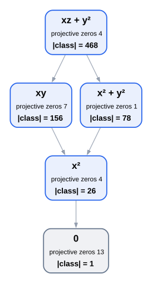
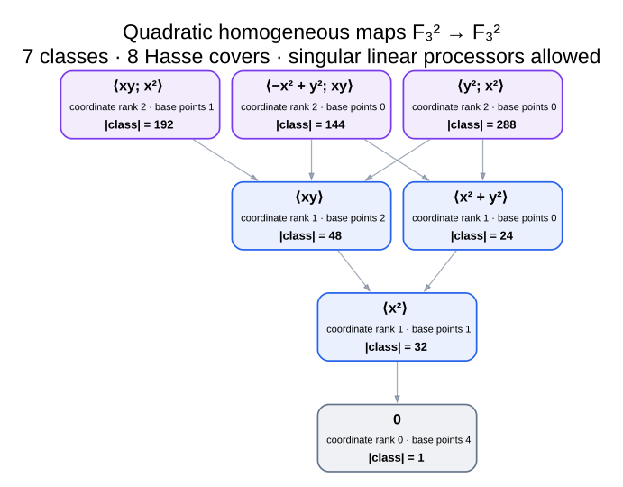
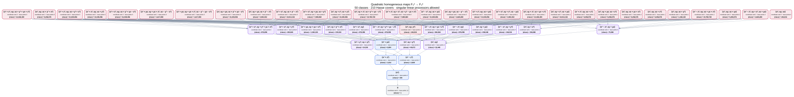
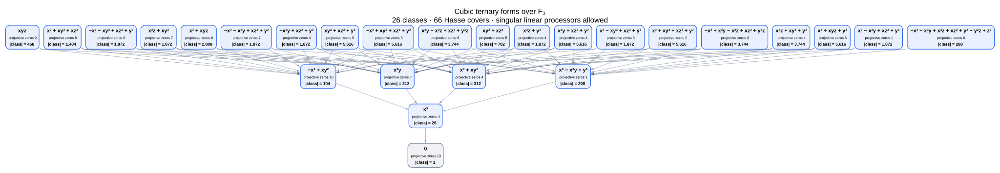
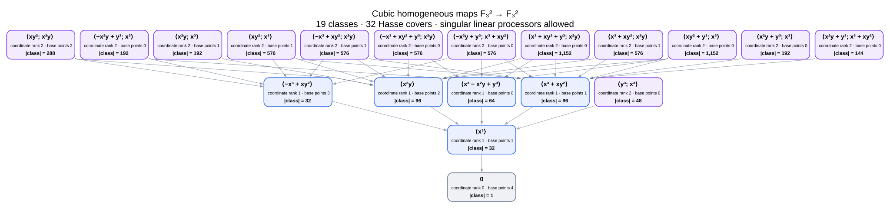
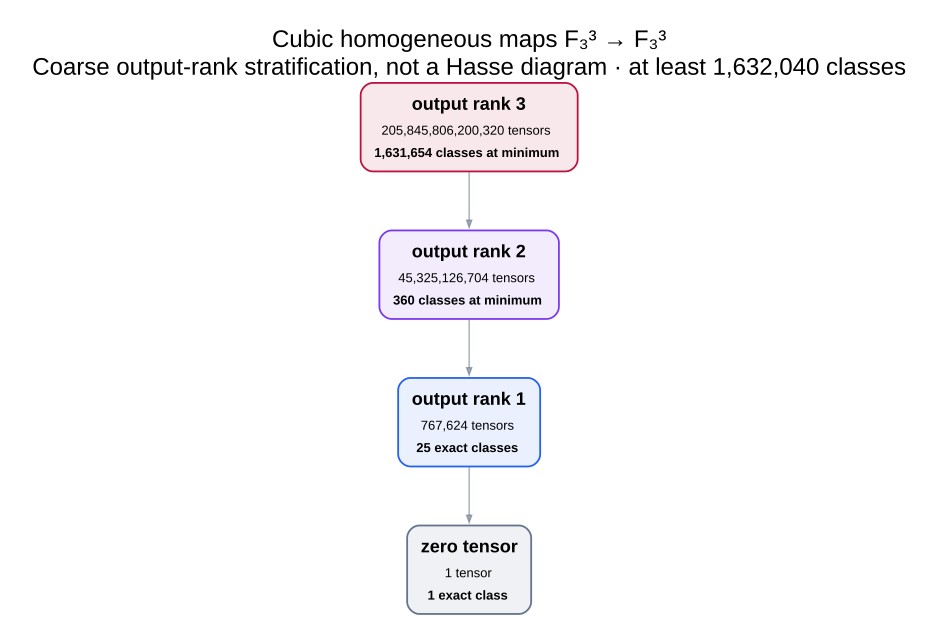

# Homogeneous tensor degeneration posets over \(\mathbb F_3\)

These six diagrams use the homogeneous-coordinate convention

\[
F\in\operatorname{Hom}(\operatorname{Sym}^d V,W).
\]

Two tensors are equivalent when

\[
G=B\circ F\circ A,
\qquad A\in GL(V),\quad B\in GL(W).
\]

The degeneration order uses the same expression with arbitrary, possibly
singular, linear maps \(A\) and \(B\).  These processors are linear rather than
affine: translations would destroy homogeneity.  Every tuple is retained,
including the zero tuple and tuples with projective base points.  A nonzero
tuple induces a projective rational map away from its common zero locus; it is
a total projective morphism exactly when the displayed base-point count is
zero.

For scalar output, a homogeneous form is treated as a section up to nonzero
scale, not as an \(\mathbb F_3\)-valued function on projective points.

Arrows point from a resource tensor to a degeneration.  Class sizes count
formal homogeneous coefficient tensors over \(\mathbb F_3\).

## Quadratic cases

### 1. Ternary quadratic forms

There are \(3^6=729\) forms, five equivalence classes, and five Hasse covers.



### 2. Quadratic tensors \(\mathbb F_3^2\to\mathbb F_3^2\)

These are pairs of binary quadratic forms.  There are \(3^6=729\) tensors,
seven classes, and eight Hasse covers.  The base-point-free nodes are the
quadratic morphisms \(\mathbf P^1\to\mathbf P^1\).



### 3. Quadratic tensors \(\mathbb F_3^3\to\mathbb F_3^3\)

These are triples of ternary quadratic forms.  There are

\[
3^{18}=387{,}420{,}489
\]

tensors, 50 equivalence classes, and 210 Hasse covers.  The calculation
quotients output changes first: a tensor of coordinate rank \(r\) is represented
by an \(r\)-dimensional subspace of the six-dimensional space of ternary
quadrics.  Only 45,256 subspaces of dimensions at most three must therefore be
enumerated.



## Cubic cases

### 4. Ternary cubic forms

There are \(3^{10}=59{,}049\) forms, 26 equivalence classes, and 66 Hasse
covers.



### 5. Cubic tensors \(\mathbb F_3^2\to\mathbb F_3^2\)

These are pairs of binary cubic forms.  There are \(3^8=6{,}561\) tensors,
19 equivalence classes, and 32 Hasse covers.  Base-point-free nodes give cubic
morphisms \(\mathbf P^1\to\mathbf P^1\).



### 6. Cubic tensors \(\mathbb F_3^3\to\mathbb F_3^3\)

A literal class-level diagram is not a finite-size drawable artifact.  The
tensor space has

\[
3^{30}=205{,}891{,}132{,}094{,}649
\]

elements.  Since

\[
|GL_3(\mathbb F_3)\times GL_3(\mathbb F_3)|
=11{,}232^2=126{,}157{,}824,
\]

no equivalence orbit can be larger than \(126{,}157{,}824\).  Splitting by
coordinate rank gives at least 1,631,654 rank-three classes and 360 rank-two
classes.  Rank one has exactly 25 nonzero classes, inherited from the ternary
cubic-form calculation, and rank zero has one.  Thus the full poset has at
least

\[
1{,}632{,}040
\]

classes.  The sixth image is explicitly a coarse output-rank stratification,
not a claimed Hasse diagram.



## Regeneration and verification

Generate all six SVGs with

```bash
./cli/homogeneous_tensor_poset_cli
```

Individual cases can be selected, for example:

```bash
./cli/homogeneous_tensor_poset_cli 1 3 5
```

Run the exhaustive checks with

```bash
PYTHONPATH=src python3 analysis/homogeneous_tensor_q3_posets.py
```
