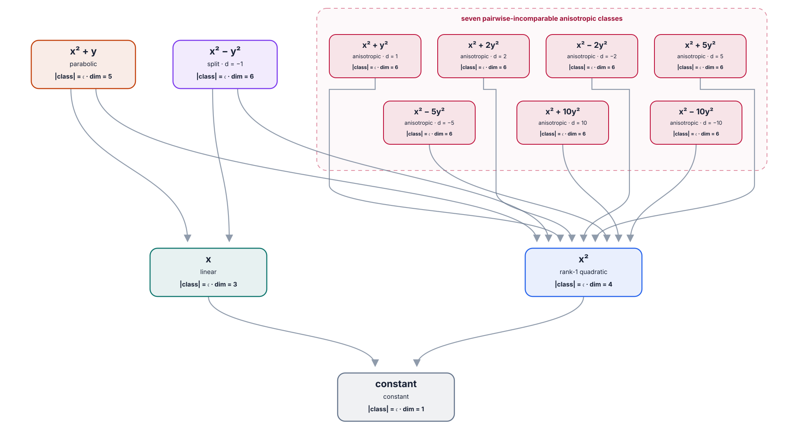

# Quadratic-map degeneration poset over \(\mathbb Q_2\)

This hand-authored diagram gives a rich \(p\)-adic example using the same
processor convention as the finite, real, and complex figures. It classifies
degree-at-most-two polynomial maps

\[
Q\colon\mathbb Q_2^2\longrightarrow\mathbb Q_2
\]

under invertible affine input and output processors. In the degeneration
order, those processors may be singular or constant.

Every nondegenerate binary quadratic form over \(\mathbb Q_2\) is similar to

\[
x^2+d y^2,
\qquad [d]\in\mathbb Q_2^\times/\mathbb Q_2^{\times2}.
\]

There are eight square classes, represented by

\[
\{1,-1,2,-2,5,-5,10,-10\}.
\]

The class \(d=-1\), represented by \(x^2-y^2\), is split and has isotropic
directions. It therefore degenerates to both \(x\) and \(x^2\). The other
seven classes are anisotropic: each degenerates to \(x^2\), but none can
degenerate to a nonconstant linear map. The square-class count is summarized
in [Sutherland, *Introduction to Arithmetic Geometry*, Lecture 10](https://math.mit.edu/classes/18.782/2013fa/LectureNotes10.pdf).

Together with the constant, linear, rank-one, and parabolic classes, this gives
12 nodes and 13 Hasse covers:

\[
\begin{aligned}
[x^2+y]&\longrightarrow[x],\ [x^2],\\
[x^2-y^2]&\longrightarrow[x],\ [x^2],\\
[x^2+d y^2]&\longrightarrow[x^2]
  &&(d\in\{1,2,-2,5,-5,10,-10\}),\\
[x],\ [x^2]&\longrightarrow[\mathrm{constant}].
\end{aligned}
\]

Every class has continuum cardinality. The node labels therefore also give
the \(2\)-adic analytic orbit dimension inside the six-dimensional coefficient
space.

The SVG is deliberately static and is not overwritten by the finite-field CLI.

Computational bounds and failed cross-copy constructions for exchange rates
between these classes are recorded in
[Attempts at affine exchange rates over \(\mathbb Q_2\)](p_adic_exchange_rate_attempts.md).
