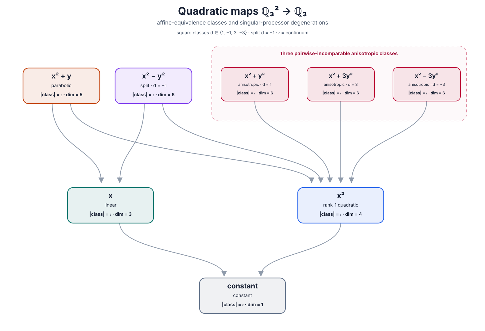

# Quadratic-map degeneration poset over \(\mathbb Q_3\)

This hand-authored diagram classifies degree-at-most-two polynomial maps

\[
Q\colon\mathbb Q_3^2\longrightarrow\mathbb Q_3
\]

under invertible affine input and output processors. In the degeneration
order, those processors may be singular or constant.

Every nondegenerate binary quadratic form over \(\mathbb Q_3\) is similar to

\[
x^2+d y^2,
\qquad [d]\in\mathbb Q_3^\times/\mathbb Q_3^{\times2}.
\]

For an odd prime \(p\), the square classes of \(\mathbb Q_p\) have
representatives \(\{1,u,p,up\}\), where \(u\) is a nonsquare unit. For
\(p=3\), take \(u=-1\), giving

\[
\{1,-1,3,-3\}.
\]

The form \(x^2+d y^2\) is split precisely when \(-d\) is a square. Hence
\(d=-1\) gives the unique split class, represented by \(x^2-y^2\), while
\(d\in\{1,3,-3\}\) gives three anisotropic classes. The four-square-class
fact and the isotropy criterion are standard consequences of the local
square-class and Hilbert-symbol calculation; see Sutherland,
[*Introduction to Arithmetic Geometry*, Lecture 10](https://math.mit.edu/classes/18.782/2023sp/LectureNotes10.pdf).

Together with the constant, linear, rank-one, and parabolic classes, this gives
8 nodes and 9 Hasse covers:

\[
\begin{aligned}
[x^2+y]&\longrightarrow[x],\ [x^2],\\
[x^2-y^2]&\longrightarrow[x],\ [x^2],\\
[x^2+d y^2]&\longrightarrow[x^2]
  &&(d\in\{1,3,-3\}),\\
[x],\ [x^2]&\longrightarrow[\mathrm{constant}].
\end{aligned}
\]

Every class has continuum cardinality. Node labels therefore also give the
\(3\)-adic analytic orbit dimension inside the six-dimensional coefficient
space.

The SVG is deliberately static and is not overwritten by the finite-field CLI.
