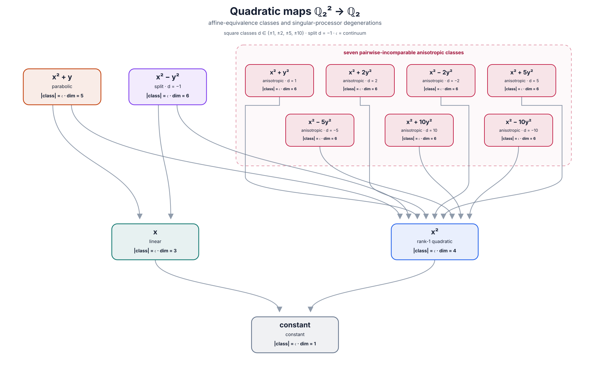
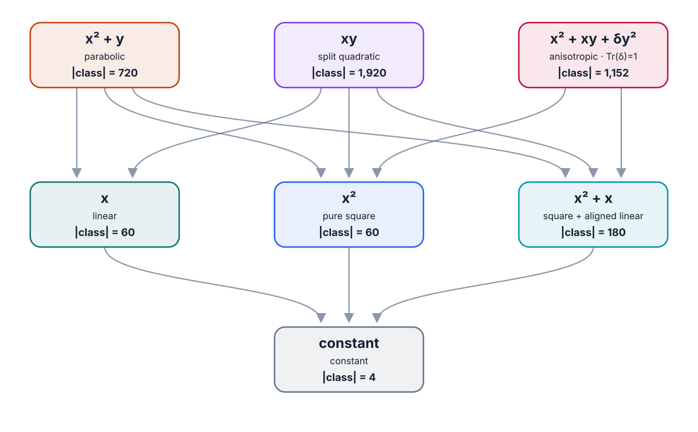
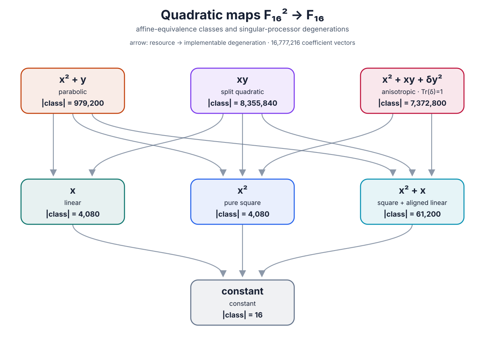
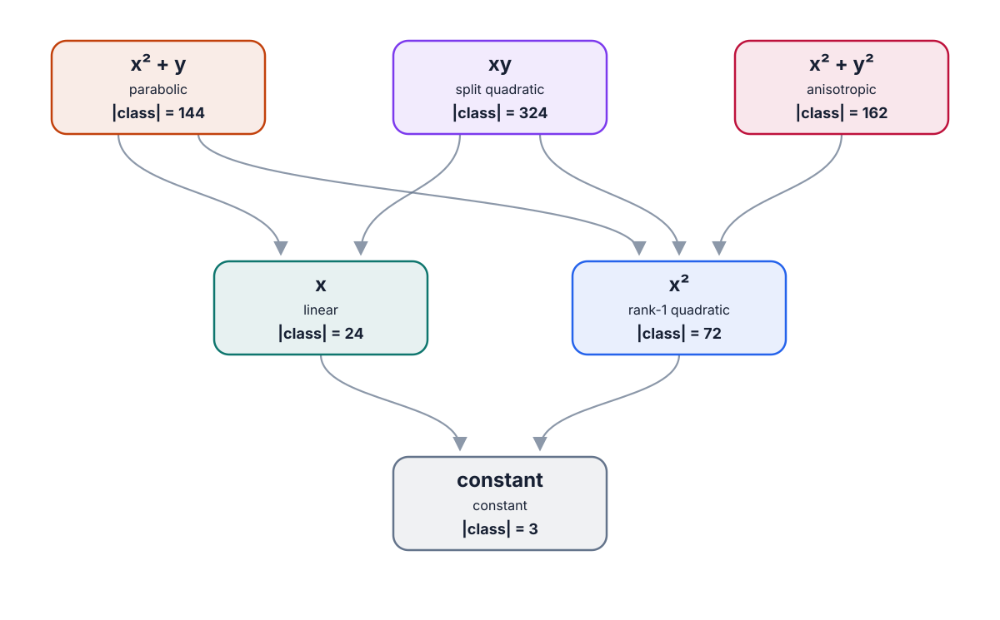
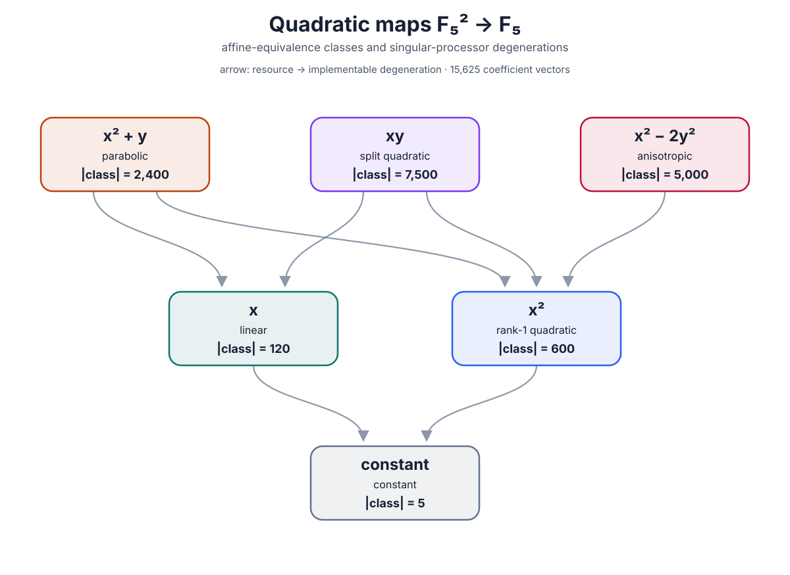
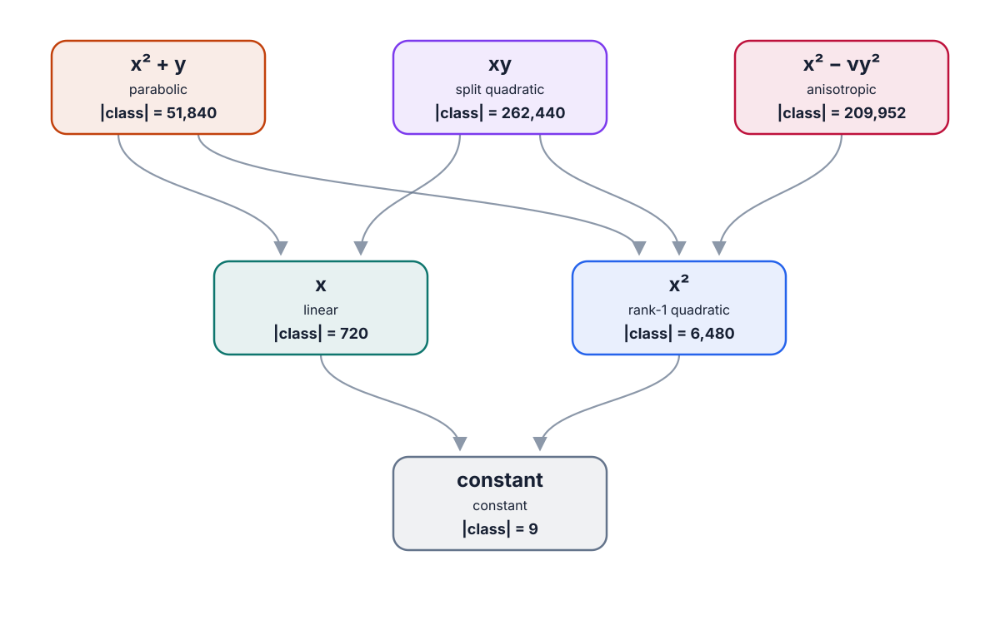
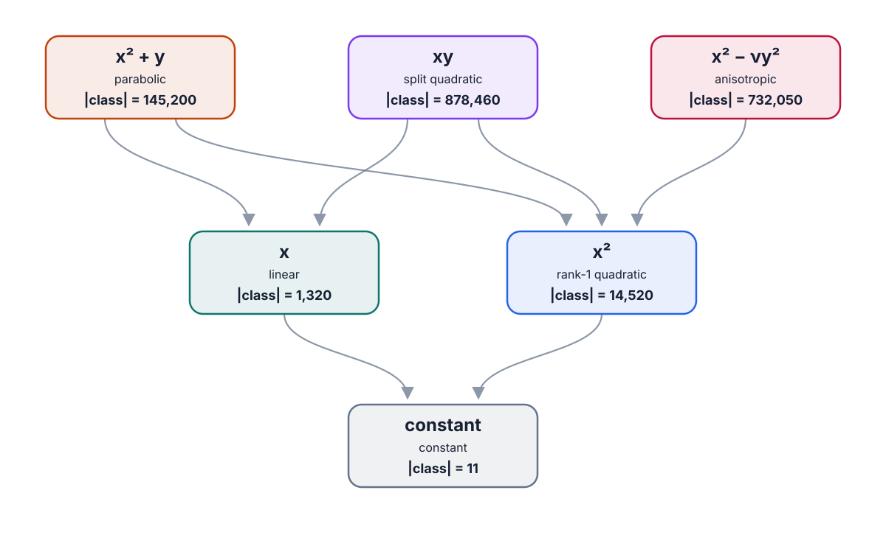
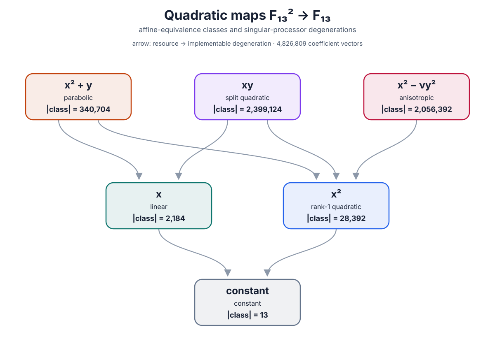

# Quadratic-map degeneration posets over finite fields

These figures classify all degree-at-most-two polynomial maps

\[
Q\colon \mathbb F_q^2\longrightarrow\mathbb F_q,
\qquad
Q(x,y)=ax^2+bxy+cy^2+dx+ey+f.
\]

The displayed fields are \(\mathbb F_2,\mathbb F_3,\mathbb F_4,\mathbb
F_5,\mathbb F_8,\mathbb F_9,\mathbb F_{11},\mathbb F_{13},\mathbb F_{16}\),
and \(\mathbb F_{25}\).

## Equivalence and order

Two maps are equivalent when

\[
Q'(z)=\alpha Q(Az+t)+\beta,
\qquad
A\in\operatorname{GL}_2(\mathbb F_q),\quad
\alpha\in\mathbb F_q^\times.
\]

Thus equivalence uses invertible affine-linear changes of input and output. For
the degeneration order, the same formula is allowed with an arbitrary matrix
\(A\) and arbitrary \(\alpha\), including singular \(A\), \(A=0\), and
\(\alpha=0\). Write \([R]\preceq[Q]\) when a representative of \([R]\) is
obtainable from one of \([Q]\) in this way. Arrows point from \([Q]\) downward
to an implementable degeneration \([R]\). Only Hasse covers are drawn.

## The binary field

Over \(\mathbb F_2\), the identities \(x^2=x\) and \(y^2=y\) hold as
functions. Consequently the formal six coefficients do not give distinct
maps: there are only \(2^4=16\) polynomial functions
\(axy+dx+ey+f\). The affine input group permutes the four input points as
\(S_4\), while the nontrivial output translation complements a Boolean
function. The classes are therefore determined by Hamming weight up to
\(w\leftrightarrow4-w\).

| class | representative | number of functions |
|---|---:|---:|
| constant | constant | 2 |
| balanced | \(x\) | 6 |
| weight 1 or 3 | \(xy\) | 8 |

The Hasse order is the three-element chain

\[
[xy]\longrightarrow[x]\longrightarrow[\mathrm{constant}].
\]

### \(q=2\)



## Even fields with \(q\ge4\)

There are seven classes. If the mixed coefficient \(b\) vanishes, the
homogeneous quadratic part is the square of a linear form. Its relation to
the ordinary linear part produces the pure-square, aligned-linear, and
parabolic cases. If \(b\ne0\), the absolute trace of \(ac/b^2\) distinguishes
the split and anisotropic forms.

| class | representative | number of coefficient vectors |
|---|---:|---:|
| constant | constant | \(q\) |
| linear | \(x\) | \(q(q^2-1)\) |
| pure square | \(x^2\) | \(q(q^2-1)\) |
| square + aligned linear | \(x^2+x\) | \(q(q-1)(q^2-1)\) |
| parabolic | \(x^2+y\) | \(q^2(q-1)(q^2-1)\) |
| split quadratic | \(xy\) | \(q^4(q^2-1)/2\) |
| anisotropic quadratic | \(x^2+xy+\delta y^2\), \(\operatorname{Tr}(\delta)=1\) | \(q^4(q-1)^2/2\) |

These values sum to \(q^6\). The Hasse covers are

\[
\begin{aligned}
[x^2+y]&\longrightarrow[x], &[x^2+y]&\longrightarrow[x^2],
  &[x^2+y]&\longrightarrow[x^2+x],\\
[xy]&\longrightarrow[x], &[xy]&\longrightarrow[x^2],
  &[xy]&\longrightarrow[x^2+x],\\
[x^2+xy+\delta y^2]&\longrightarrow[x^2],
  &[x^2+xy+\delta y^2]&\longrightarrow[x^2+x],\\
[x]&\longrightarrow[\mathrm{constant}],
  &[x^2]&\longrightarrow[\mathrm{constant}],
  &[x^2+x]&\longrightarrow[\mathrm{constant}].
\end{aligned}
\]

The anisotropic class has no arrow to the linear class: a rank-one input
restriction would need an isotropic direction to eliminate the quadratic
term. The pure square, aligned-linear, and linear classes are mutually
incomparable for \(q>2\).

### \(q=4\)

There are \(4^6=4{,}096\) maps. The seven class sizes are
\(4,60,60,180,720,1{,}920,1{,}152\).



### \(q=8\)

There are \(8^6=262{,}144\) maps. The seven class sizes are
\(8,504,504,3{,}528,28{,}224,129{,}024,100{,}352\).


### \(q=16\)

There are \(16^6=16{,}777{,}216\) maps. The seven class sizes are
\(16,4{,}080,4{,}080,61{,}200,979{,}200,8{,}355{,}840,7{,}372{,}800\).



## Odd fields

There are six equivalence classes for every odd \(q\):

| class | representative | number of coefficient vectors |
|---|---:|---:|
| constant | constant | \(q\) |
| linear | \(x\) | \(q(q^2-1)\) |
| rank-1 quadratic | \(x^2\) | \(q^2(q^2-1)\) |
| parabolic | \(x^2+y\) | \(q^2(q-1)(q^2-1)\) |
| split quadratic | \(xy\) | \(q^4(q^2-1)/2\) |
| anisotropic quadratic | \(x^2-\nu y^2\), \(\nu\) nonsquare | \(q^4(q-1)^2/2\) |

The six values sum to \(q^6\). The Hasse covers are

\[
\begin{aligned}
[x^2+y]&\longrightarrow[x], &[x^2+y]&\longrightarrow[x^2],\\
[xy]&\longrightarrow[x], &[xy]&\longrightarrow[x^2],\\
[x^2-\nu y^2]&\longrightarrow[x^2],\\
[x]&\longrightarrow[\mathrm{constant}], &
[x^2]&\longrightarrow[\mathrm{constant}].
\end{aligned}
\]

### \(q=3\)

There are \(3^6=729\) maps. The anisotropic representative can be written
\(x^2+y^2\). The six class sizes are \(3,24,72,144,324,162\).



### \(q=5\)

There are \(5^6=15{,}625\) maps. Taking \(2\) as a nonsquare gives the
anisotropic representative \(x^2-2y^2\). The six class sizes are
\(5,120,600,2{,}400,7{,}500,5{,}000\).



### \(q=9\)

There are \(9^6=531{,}441\) maps. The six class sizes are
\(9,720,6{,}480,51{,}840,262{,}440,209{,}952\).



### \(q=11\)

There are \(11^6=1{,}771{,}561\) maps. The six class sizes are
\(11,1{,}320,14{,}520,145{,}200,878{,}460,732{,}050\).



### \(q=13\)

There are \(13^6=4{,}826{,}809\) maps. The six class sizes are
\(13,2{,}184,28{,}392,340{,}704,2{,}399{,}124,2{,}056{,}392\).



### \(q=25\)

There are \(25^6=244{,}140{,}625\) maps. The six class sizes are
\(25,15{,}600,390{,}000,9{,}360{,}000,121{,}875{,}000,112{,}500{,}000\).


## Real and complex comparison

The corresponding manually drawn diagrams over \(\mathbb R\) and \(\mathbb
C\), where orbit dimension replaces finite class size, are documented in
[Quadratic-map degeneration posets over \(\mathbb R\) and \(\mathbb C\)](real_complex_quadratic_map_posets.md).

Examples with several anisotropic classes are the hand-authored
[\(2\)-adic](p_adic_quadratic_map_poset.md) and
[\(3\)-adic](q3_adic_quadratic_map_poset.md) quadratic-map posets.

## Regeneration

From the project root, regenerate all ten committed SVGs with

```bash
./cli/finite_field_map_poset_cli
```

Generate selected prime-power cases or choose another output directory with

```bash
./cli/finite_field_map_poset_cli 2 4 8 9 11 13 16 25 --output-dir /tmp/quadratic-posets
```
