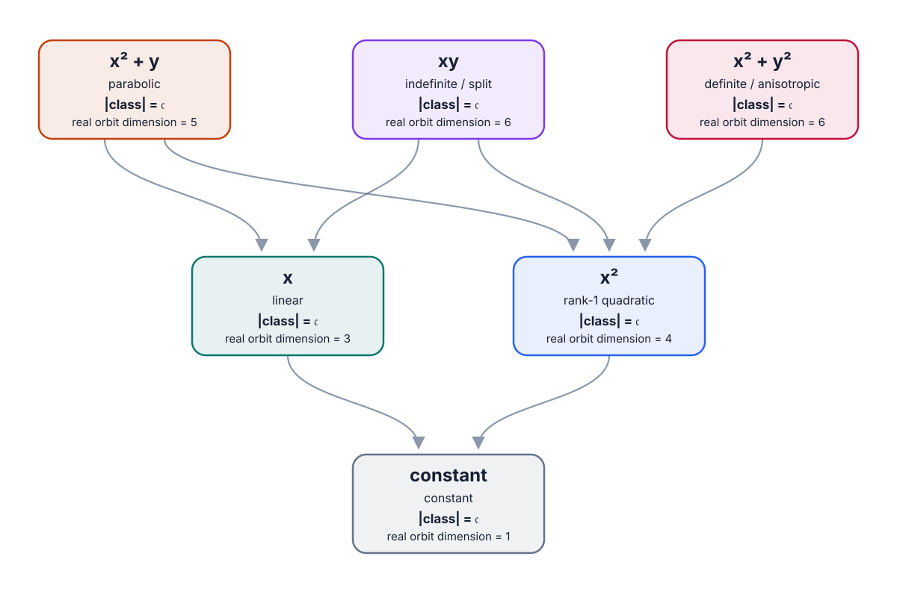
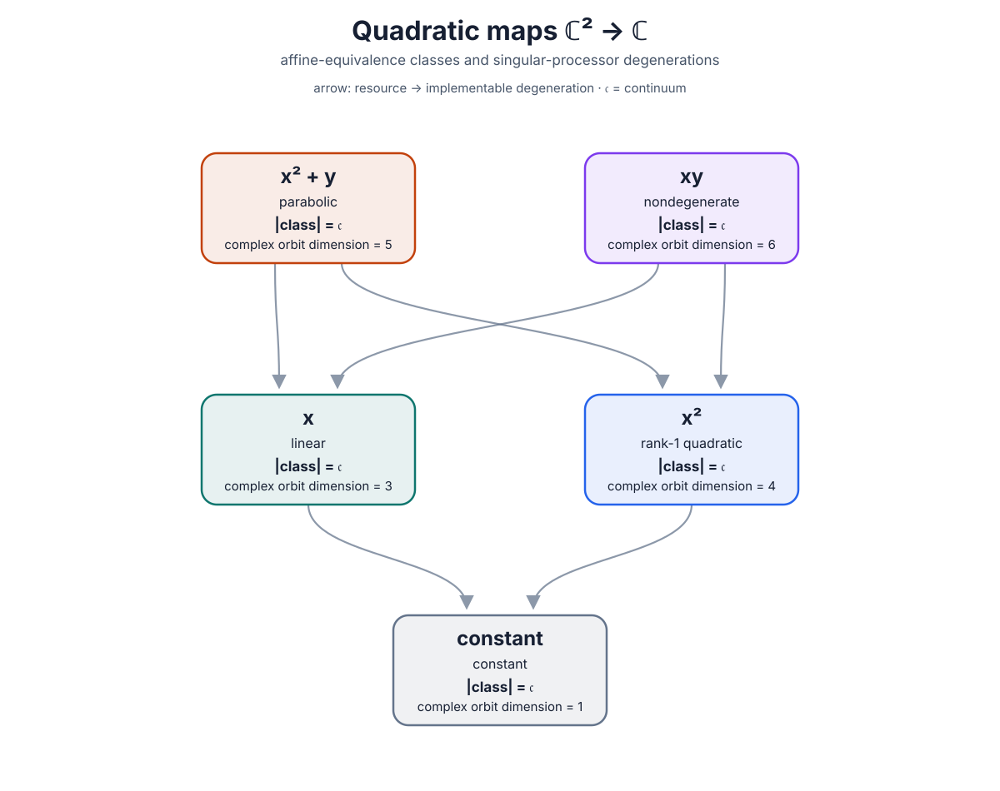

# Quadratic-map degeneration posets over \(\mathbb R\) and \(\mathbb C\)

These two hand-authored diagrams use the same convention as the finite-field
figures. For \(K=\mathbb R\) or \(K=\mathbb C\), consider

\[
Q\colon K^2\longrightarrow K,
\qquad
Q(x,y)=ax^2+bxy+cy^2+dx+ey+f.
\]

Equivalence means

\[
Q'(z)=\alpha Q(Az+t)+\beta,
\qquad A\in\operatorname{GL}_2(K),\quad \alpha\ne0.
\]

For degeneration, \(A\) and \(\alpha\) may be singular, including \(A=0\)
and \(\alpha=0\). Arrows point from a resource to an immediately obtainable
degeneration.

## Why dimensions replace finite sizes

Every equivalence class in either diagram has continuum cardinality, so raw
cardinality does not distinguish the classes. Each node therefore shows both
\(|\mathrm{class}|=\mathfrak c\) and the dimension of the orbit inside the
six-dimensional coefficient space. Dimensions are real dimensions for the
\(\mathbb R\) diagram and complex dimensions for the \(\mathbb C\) diagram.

| representative | type | orbit dimension |
|---:|---|---:|
| constant | constant | 1 |
| \(x\) | linear | 3 |
| \(x^2\) | rank-1 quadratic | 4 |
| \(x^2+y\) | parabolic | 5 |
| nondegenerate quadratic | open stratum | 6 |

To see the classification, write \(Q(z)=z^{\mathsf T}Sz+\ell^{\mathsf T}z+c\).
A translation removes the component of \(\ell\) carried by \(S\). If
\(\operatorname{rank}S=1\), the remaining component along the radical is
either zero, giving \(x^2\), or nonzero, giving \(x^2+y\). If \(S\) is
nonsingular, all linear terms can be removed. The remaining real and complex
normal forms follow from the usual classification of quadratic forms; see
[Kimball Martin, *Quaternion algebras and quadratic forms*, Theorem 3.2.2](https://www2.math.ou.edu/~kmartin/quaint/ch3.pdf).

## Real maps

Over \(\mathbb R\), scalar output rescaling identifies positive- and
negative-definite forms. This leaves two nondegenerate classes: the indefinite
form \(xy\) and the definite form \(x^2+y^2\).

The indefinite form has isotropic directions and therefore degenerates to
both \(x\) and \(x^2\). The definite form has no real isotropic direction, so
it degenerates to \(x^2\) but not to a nonconstant linear map. Thus the real
diagram has six nodes and seven Hasse covers.

## Complex maps

Over \(\mathbb C\), every nonsingular binary quadratic form is equivalent up
to scale to \(xy\); in particular, there is no separate definite class. This
form has isotropic directions, so it degenerates to both \(x\) and \(x^2\).
The complex diagram consequently has five nodes and six Hasse covers.

The two SVG files are deliberately static, hand-authored figures. The
finite-field CLI does not overwrite them.
